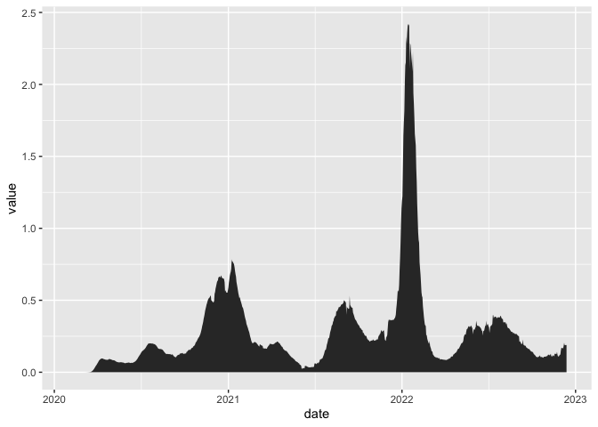
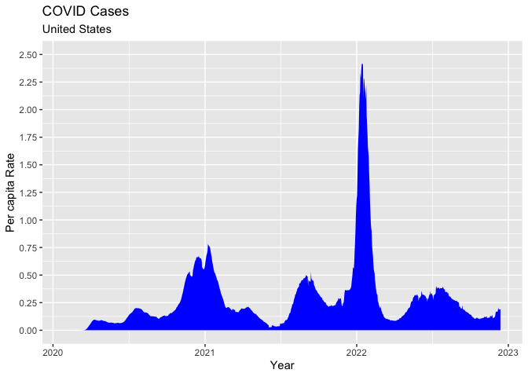
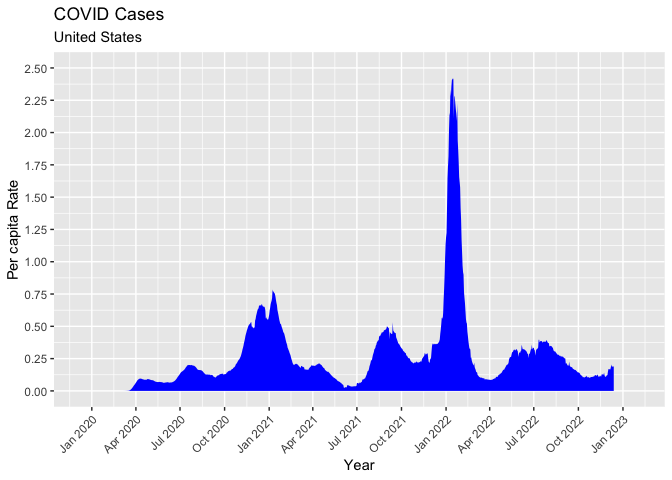
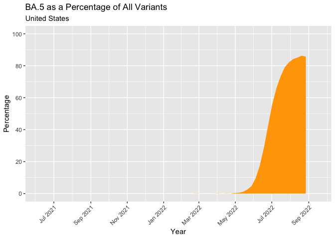
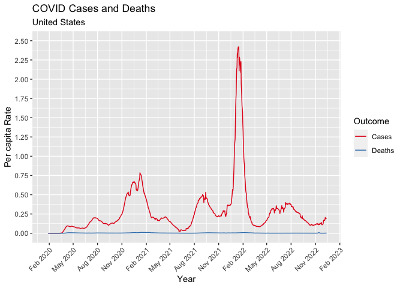
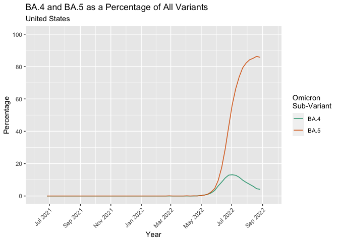
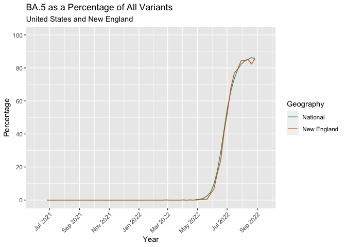

Data Skills 05 - Plotting Time Series Data with ggplot2 - Complete
================
Christopher Prener, Ph.D.
(February 01, 2023)

## Dependencies

This notebook requires two packages from the `tidyverse` as well as two
additional packages:

``` r
# tidyverse packages
library(dplyr)     # data wrangling
```

    ## 
    ## Attaching package: 'dplyr'

    ## The following objects are masked from 'package:stats':
    ## 
    ##     filter, lag

    ## The following objects are masked from 'package:base':
    ## 
    ##     intersect, setdiff, setequal, union

``` r
library(ggplot2)   # plotting
library(readr)     # read and write csv files

# manage file paths
library(here)      # manage file paths
```

    ## here() starts at /Users/prenec/Documents/GitHub/data_skills/data-skills-05

## Load Data

For this session and our future sessions this spring, we’ll focus on two
sets of data - COVID cases and mortality from the New York Times and
SARS-CoV-2 variants from the CDC. For today, we’ll use pre-cleaned
versions of both. First, we’ll load the COVID case and mortality data:

``` r
nyt_wide <- read_csv(here("data", "nyt_usa_covid_wide.csv"))
```

    ## Rows: 1058 Columns: 5
    ## ── Column specification ────────────────────────────────────────────────────────
    ## Delimiter: ","
    ## dbl  (4): cases, cases_avg7_pc, deaths, deaths_avg7_pc
    ## date (1): date
    ## 
    ## ℹ Use `spec()` to retrieve the full column specification for this data.
    ## ℹ Specify the column types or set `show_col_types = FALSE` to quiet this message.

``` r
nyt_long <- read_csv(here("data", "nyt_usa_covid_long.csv"))
```

    ## Rows: 4232 Columns: 3
    ## ── Column specification ────────────────────────────────────────────────────────
    ## Delimiter: ","
    ## chr  (1): measure
    ## dbl  (1): value
    ## date (1): date
    ## 
    ## ℹ Use `spec()` to retrieve the full column specification for this data.
    ## ℹ Specify the column types or set `show_col_types = FALSE` to quiet this message.

Next, you write a similar statement to load the CDC data:

``` r
cdc <- read_csv(here("data", "cdc_concentrations.csv"))
```

    ## Rows: 248 Columns: 8
    ## ── Column specification ────────────────────────────────────────────────────────
    ## Delimiter: ","
    ## chr  (4): region, pango, who, variant
    ## dbl  (3): pct, pct_ci_lo, pct_ci_hi
    ## date (1): week
    ## 
    ## ℹ Use `spec()` to retrieve the full column specification for this data.
    ## ℹ Specify the column types or set `show_col_types = FALSE` to quiet this message.

## Data Preparation

We have two versions of the New York Times data to look at - “wide”
formatted data and “long” formatted data.

``` r
head(nyt_wide, n = 10L)
```

    ## # A tibble: 10 × 5
    ##    date       cases cases_avg7_pc deaths deaths_avg7_pc
    ##    <date>     <dbl>         <dbl>  <dbl>          <dbl>
    ##  1 2020-01-21     1   NA               0             NA
    ##  2 2020-01-22     1   NA               0             NA
    ##  3 2020-01-23     1   NA               0             NA
    ##  4 2020-01-24     2   NA               0             NA
    ##  5 2020-01-25     3   NA               0             NA
    ##  6 2020-01-26     5   NA               0             NA
    ##  7 2020-01-27     5   NA               0             NA
    ##  8 2020-01-28     5    0.00000173      0              0
    ##  9 2020-01-29     5    0.00000173      0              0
    ## 10 2020-01-30     6    0.00000217      0              0

Notice how we have one row per day, with columns representing different
measures.

*As an aside, notice how I specified the `n = 10L`. The `L` confirms for
`R` that we are passing an integer value. Usually, functions will work
without it, but it is a good idea to be clear to `R` that you want an
integer and only an integer. Ignoring this works until it doesn’t!*

Next, we’ll explore the long data:

``` r
head(nyt_long, n = 40L)
```

    ## # A tibble: 40 × 3
    ##    date       measure        value
    ##    <date>     <chr>          <dbl>
    ##  1 2020-01-21 cases              1
    ##  2 2020-01-21 cases_avg7_pc     NA
    ##  3 2020-01-21 deaths             0
    ##  4 2020-01-21 deaths_avg7_pc    NA
    ##  5 2020-01-22 cases              1
    ##  6 2020-01-22 cases_avg7_pc     NA
    ##  7 2020-01-22 deaths             0
    ##  8 2020-01-22 deaths_avg7_pc    NA
    ##  9 2020-01-23 cases              1
    ## 10 2020-01-23 cases_avg7_pc     NA
    ## # … with 30 more rows

Notice how we have one row per measure, with multiple rows per day. This
is the format that we need to work in for plotting longitudinal data.
Next week, we’ll talk about the work needed to wrangle data into this
format. For now, though, we’ll move on to the plotting piece!

``` r
rm(nyt_wide)
```

## Plotting with `geom_area`

`ggplot2` contains a number of tools for showing change over time. We’ll
start with `geom_area()` and review the main components of a `ggplot`
call. Notice how we pipe our data into the `ggplot()` call below: we
take our `nyt_long` data **then** subset to our selected measure
**then** create our plot with those data.

``` r
nyt_long %>%
  filter(measure == "cases_avg7_pc") %>%
  ggplot(mapping = aes(x = date, y = value)) +
    geom_area()
```

    ## Warning: Removed 7 rows containing missing values (position_stack).

<!-- -->

Recall from our last session that there are a number of ways we can
augment our plots, including altering the `y` axis breaks, updating our
labels, and adding a title and subtitle. We can also select a fill for
our area data itself.

``` r
nyt_long %>%
  filter(measure == "cases_avg7_pc") %>%
  ggplot(mapping = aes(x = date, y = value)) +
    geom_area(fill = "blue") +
    scale_y_continuous(limits = c(0, 2.5), breaks = seq(0, 2.5, by = .25)) +
    labs(
      title = "COVID Cases",
      subtitle = "United States",
      x = "Year",
      y = "Per capita Rate"
    )
```

    ## Warning: Removed 7 rows containing missing values (position_stack).

<!-- -->

One additional tool we can use is to alter our x axis to show months
instead of years. We can do this with `scale_x_date()`. There are a
number of key pieces: \* Breaks can be specified in counts of days,
weeks, months, or years \* Labels require `scales::label_date()` \* The
labels can be a combination of values, like `%B` for the month name,
`%b` for the month abbreviation, `%Y` for year, `%d` for day \* Finally,
we can experiment with the `expand` argument to force the x-axis labels
outward - *this requires lots of trial and error!* \* Placing the x-axis
labels at an angle usually helps with readability using the `theme()`
function’s `axis.text.x` argument

``` r
nyt_long %>%
  filter(measure == "cases_avg7_pc") %>%
  ggplot(mapping = aes(x = date, y = value)) +
    geom_area(fill = "blue") +
    scale_x_date(breaks = "3 months", labels = scales::label_date("%b %Y"), expand = c(.1, .1)) + 
    scale_y_continuous(limits = c(0, 2.5), breaks = seq(0, 2.5, by = .25)) +
    labs(
      title = "COVID Cases",
      subtitle = "United States",
      x = "Year",
      y = "Per capita Rate"
    ) +
  theme(
    axis.text.x = ggplot2::element_text(angle = 45, hjust = 1)
  )
```

    ## Warning: Removed 7 rows containing missing values (position_stack).

<!-- -->

Now, you experiment with `geom_area()` by using the `cdc` data to
isolate `BA.5` observations when the region is equal to `USA`. Try to
experiment with `x` axis breaks and labels to achieve different designs
for your plot!

``` r
cdc %>%
  filter(variant == "BA.5" & region == "USA") %>%
  ggplot(mapping = aes(x = week, y = pct)) +
    geom_area(fill = "orange") +
    scale_x_date(breaks = "2 months", labels = scales::label_date("%b %Y"), expand = c(.1,.1)) + 
    scale_y_continuous(limits = c(0, 100), breaks = seq(0, 100, by = 20)) +
    labs(
      title = "BA.5 as a Percentage of All Variants",
      subtitle = "United States",
      x = "Year",
      y = "Percentage"
    ) +
  theme(
    axis.text.x = ggplot2::element_text(angle = 45, hjust = 1)
  )
```

<!-- -->

## Plotting with `geom_line`

An alternative to `geom_area()` is the `geom_line()` function, which
works very similarly. One advantage of `geom_line()` from a design
standpoint is “less ink” on the plot. This makes it easier to compare
multiple trends. For example, we could leverage it to plot cases and
deaths simultaneously. Most of the code here is the same as above, but I
have altered the initial `filter()` statement to include deaths and also
cleaned up those `measure` values so that they are more appropriate for
plotting. To deal with two groups, notice that `color = measure` now
appears in our aesthetic mapping instead of being hard-coded into
`geom_line()`. I’ve also added `scale_color_brewer()` to tweak the line
colors and the name of the legend.

``` r
nyt_long %>%
  filter(measure %in% c("cases_avg7_pc", "deaths_avg7_pc") == TRUE) %>%
  mutate(measure = ifelse(measure == "cases_avg7_pc", "Cases", "Deaths")) %>%
  ggplot(mapping = aes(x = date, y = value, color = measure)) +
    geom_line() + 
    scale_x_date(breaks = "3 months", labels = scales::label_date("%b %Y")) + 
    scale_y_continuous(limits = c(0, 2.5), breaks = seq(0, 2.5, by = .25)) +
    scale_color_brewer(palette = "Set1", name = "Outcome") +
    labs(
      title = "COVID Cases and Deaths",
      subtitle = "United States",
      x = "Year",
      y = "Per capita Rate"
    ) +
  theme(
    axis.text.x = ggplot2::element_text(angle = 45, hjust = 1)
  )
```

    ## Warning: Removed 14 row(s) containing missing values (geom_path).

<!-- -->

This is often where people will jump in with a “dual y-axis” plot.
`ggplot2` does not make it easy to build these, and honestly, that is a
good thing. The dual y-axis plot can be a great way to mislead viewers.
If you notice that your two distributions work on *very* different
scales, step back and ask yourself if one plot is appropriate. There are
other options out there!

Now, you take a turn - write out code to simultaneously plot BA.4 and
BA.5 over time, coloring the lines for each sub-variant in a different
color. Focus on the national data only!

``` r
cdc %>%
  filter(region == "USA") %>%
  ggplot(mapping = aes(x = week, y = pct, color = variant)) +
    geom_line() + 
    scale_x_date(breaks = "2 months", labels = scales::label_date("%b %Y"), expand = c(.1,.1)) + 
    scale_y_continuous(limits = c(0, 100), breaks = seq(0, 100, by = 20)) +
    scale_color_brewer(palette = "Dark2", name = "Omicron\nSub-Variant") +
    labs(
      title = "BA.4 and BA.5 as a Percentage of All Variants",
      subtitle = "United States",
      x = "Year",
      y = "Percentage"
    ) +
  theme(
    axis.text.x = ggplot2::element_text(angle = 45, hjust = 1)
  )
```

<!-- -->

Finally, if you have time, create a plot of BA.5 over time between the
US as a whole and HHS Region 1 (New England):

``` r
cdc %>%
  filter(variant == "BA.5") %>%
  mutate(region = ifelse(region == "HHS1", "New England", "National")) %>%
  ggplot(mapping = aes(x = week, y = pct, color = region)) +
    geom_line() + 
    scale_x_date(breaks = "2 months", labels = scales::label_date("%b %Y"), expand = c(.1,.1)) + 
    scale_y_continuous(limits = c(0, 100), breaks = seq(0, 100, by = 20)) +
    scale_color_brewer(palette = "Dark2", name = "Geography") +
    labs(
      title = "BA.5 as a Percentage of All Variants",
      subtitle = "United States and New England",
      x = "Year",
      y = "Percentage"
    ) +
  theme(
    axis.text.x = ggplot2::element_text(angle = 45, hjust = 1)
  )
```

<!-- -->
